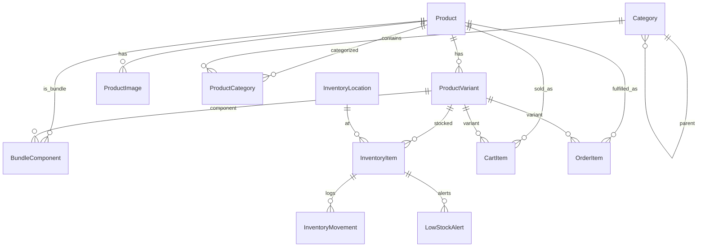
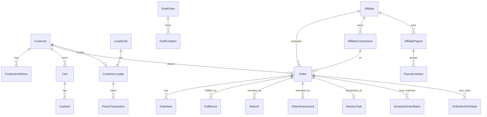
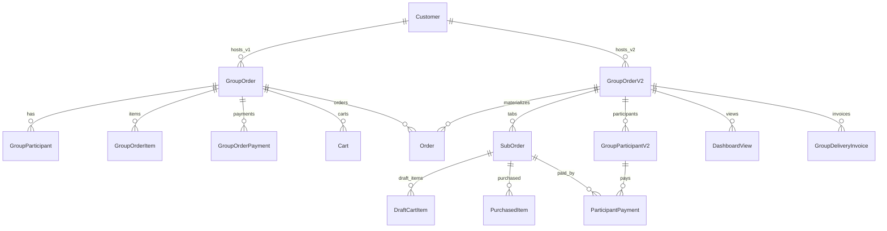

# Data Model

Source of truth: `prisma/schema.prisma`. Datasource is PostgreSQL (`POSTGRES_URL`, `POSTGRES_URL_NON_POOLING`). 77 models, 43 enums. Migrations live under `prisma/migrations/` (managed by Prisma CLI via `npm run db:migrate` / `db:push`).

> _`DeliveryZone` and `TaxRate` were removed 2026-04-23. Runtime uses hardcoded TS tables in `src/lib/delivery/rates.ts` and `src/lib/tax/rates.ts`. Postgres tables `delivery_zones` and `tax_rates` remain — drop in future migration._
>
> _`LoyaltyTier`, `CustomerLoyalty`, `PointsTransaction` are retained in the schema but the application code that read/wrote them was removed 2026-04-23 (loyalty program deprecated). Models retained for data preservation._

> This document groups models into domain clusters and mirrors the schema verbatim — when fields are listed, they are present in `schema.prisma`. For any model, consult the line numbers below to read the definitive definition.

## Model line index (for grepping in `prisma/schema.prisma`)

| Line | Model | Line | Model | Line | Model |
|---:|---|---:|---|---:|---|
| 13 | PartnerInquiry | 753 | Order | 1702 | GroupOrderV2 |
| 34 | AnalyticsSnapshot | 837 | OrderItem | 1736 | SubOrder |
| 66 | Experiment | 865 | Fulfillment | 1768 | GroupParticipantV2 |
| 95 | ExperimentVariant | 893 | Refund | 1793 | DraftCartItem |
| 116 | GroupOrderItem | 948 | OrderAmendment | 1819 | PurchasedItem |
| 136 | GroupOrder | 972 | OrderItemPickState | 1846 | ParticipantPayment |
| 173 | GroupParticipant | 1002 | AIInventoryCount | 1878 | EmailTemplateContent |
| 203 | OrderAnalytics | 1029 | AIInventoryQuery | 1893 | InventoryNote |
| 253 | GroupOrderPayment | 1043 | InventoryPrediction | 1911 | ReceivingInvoice |
| 288 | Product | 1076 | FeatureFlag | 1932 | ReceivingInvoiceLine |
| 342 | ProductVariant | 1091 | ShopifySync | 1953 | DistributorSkuMap |
| 396 | ProductImage | 1126 | DeliveryTask | 1971 | GroupDeliveryInvoice |
| 417 | Category | 1165 | EmailLog | 1993 | WebhookEvent |
| 440 | ProductCategory | 1241 | Discount | 2045 | PartnerApplication |
| 452 | BundleComponent | 1295 | DiscountUsage | 2070 | Affiliate |
| 479 | InventoryLocation | 1311 | ReferralCode | 2111 | DashboardTemplate |
| 495 | InventoryItem | 1329 | AutomaticDiscount | 2137 | AffiliateWebhookLog |
| 527 | InventoryMovement | 1378 | LoyaltyTier | 2156 | DashboardView |
| 556 | LowStockAlert | 1397 | CustomerLoyalty | 2167 | AffiliateCommission |
| 597 | Customer | 1417 | PointsTransaction | 2196 | AffiliatePayout |
| 645 | CustomerAddress | 1446 | VercelAnalyticsEvent | 2217 | PayoutLineItem |
| 676 | Cart | 1503 | DrinkCalculatorLead | 2230 | MagicLinkToken |
| 722 | CartItem | 1526 | DraftOrder | 2249 | AgentConversation |
| | | | | 2273 | AgentProposal |
| | | | | 2291 | McpRequestLog |
| | | | | 2313 | BoatSchedule |
| | | | | 2351 | ScheduleOrderMatch |
| | | | | 2371 | SyncLog |

## Enums (all 43)

| Enum | Values |
|---|---|
| `ExperimentStatus` | DRAFT, RUNNING, PAUSED, COMPLETED |
| `GroupOrderStatus` | (see line 223) |
| `ParticipantStatus` | (line 231) |
| `PaymentStatus` | (line 237) |
| `HostDecision` | (line 246) |
| `OrderSource` | (line 278) |
| `ProductStatus` | (line 469) |
| `InventoryMovementType` | (line 574) |
| `AlertStatus` | (line 587) |
| `CartStatus` | ACTIVE, ABANDONED, CONVERTED, EXPIRED |
| `OrderStatus` | (line 913) |
| `FinancialStatus` | (line 923) |
| `FulfillmentStatus` | (line 932) |
| `RefundStatus` | (line 941) |
| `AmendmentType` | (line 977) |
| `AmendmentResolution` | (line 984) |
| `DeliveryType` | HOUSE, BOAT, VENUE (line 992) |
| `AICountStatus` | (line 1064) |
| `SyncDirection` | (line 1109) |
| `SyncStatus` | (line 1115) |
| `DeliveryTaskStatus` | (line 1199) |
| `EmailType` | (line 1208) |
| `EmailStatus` | (line 1227) |
| `DiscountType` | (line 1360) |
| `AutoDiscountTrigger` | (line 1367) |
| `PointsType` | (line 1434) |
| `DraftOrderStatus` | (line 1594) |
| `PartyType` | (line 1650) |
| `DashboardSource` | (line 1661) |
| `DeliveryContextType` | (line 1668) |
| `GroupOrderV2Status` | (line 1676) |
| `SubOrderStatus` | (line 1683) |
| `GroupV2ParticipantStatus` | (line 1690) |
| `GroupV2PaymentStatus` | (line 1695) |
| `ApplicationStatus` | (line 2009) |
| `AffiliateStatus` | (line 2015) |
| `AffiliateCategory` | (line 2022) |
| `CommissionStatus` | (line 2031) |
| `PayoutStatus` | (line 2039) |
| `WebhookLogStatus` | (line 2125) |
| `CallbackStatus` | (line 2130) |
| `AgentProposalType` | (line 2262) |
| `AgentProposalStatus` | (line 2267) |

## ER diagram — Catalog & Inventory

## ER diagram — Customers, Orders, Fulfilment

## ER diagram — Group orders (v1 + v2)

## Domain: Catalog & Inventory

### Product (line 288)
- Purpose: central product row. Handles, Shopify sync, pricing, ABV, bundle flag.
- Key fields: `id`, `handle` (unique), `title`, `basePrice` Decimal(10,2), `status ProductStatus`, `shopifyId?` (unique), `abv?`, `isBundle`.
- Relations: → `ProductVariant[]`, `ProductImage[]`, `ProductCategory[]`, `InventoryItem[]`, `CartItem[]`, `OrderItem[]`, `DraftCartItem[]`, `PurchasedItem[]`, `BundleComponent[]` (two relations: `BundleProduct` + `ComponentProduct`).
- Touched by: `/api/v1/products*`, `/api/v1/admin/products*`, `/api/products*`, Shopify sync (`src/lib/shopify/`, `ShopifySync` / `SyncLog`).

### ProductVariant (line 342)
- Purpose: price + inventory per SKU/variant (size, 750ml vs 1L).
- Key fields: `sku?`, `price`, `option1..3Name/Value`, `inventoryQuantity`, `committedQuantity`, `trackInventory`, `allowBackorder`, `availableForSale`.
- Relations: → `Product`, `ProductImage?`, `InventoryItem[]`, `InventoryMovement[]`, `CartItem[]`, `OrderItem[]`, `DraftCartItem[]`, `PurchasedItem[]`, `BundleComponent[]`.

### ProductImage (line 396)
- Fields: `url`, `altText`, position, `shopifyId?`. Many-to-one `Product`, one-to-many `ProductVariant`.

### Category (line 417) & ProductCategory (line 440)
- Hierarchical (`parentId` self-relation), with `shopifyCollectionId` sync. Join table `ProductCategory` attaches products to categories.

### BundleComponent (line 452)
- Represents one product inside a bundle (two relations back to `Product`: the bundle and the component). Quantity-bearing.

### InventoryLocation (line 479) / InventoryItem (line 495) / InventoryMovement (line 527) / LowStockAlert (line 556)
- Per-location stock (Austin warehouse, partner locations) with movement ledger and alert queue.
- Enums: `InventoryMovementType`, `AlertStatus`.

### AIInventoryCount / AIInventoryQuery / InventoryPrediction (lines 1002–1063)
- AI-driven: image-based count sessions, natural-language queries, forecasts. Enum `AICountStatus`.

### InventoryNote (1893), ReceivingInvoice (1911), ReceivingInvoiceLine (1932), DistributorSkuMap (1953)
- Workflow: upload distributor invoice photo → OCR/Claude-parse → create `ReceivingInvoice` + `ReceivingInvoiceLine`s → map distributor SKUs (`DistributorSkuMap`) → apply → inventory movement.
- Surfaces at `/ops/inventory/receiving/*`.

## Domain: Customers, Cart, Checkout

### Customer (line 597)
- Fields include `email (unique)`, `passwordHash?`, `ageVerified`, `dateOfBirth?`, `stripeCustomerId?`, `shopifyId?`.
- Relations: addresses, carts, orders, group-order participation (v1 + v2), loyalty (schema-only — code removed 2026-04-23).

### CustomerAddress (645)
- Default `province = "TX"`, `country = "US"`. `isDefault` flag.

### Cart (676) / CartItem (722)
- Server-mirrored cart with delivery details, discounts, cached totals, group-order association, abandonment tracking (`abandonedAt`, `recoveryEmailSent`).
- `CartStatus`: ACTIVE | ABANDONED | CONVERTED | EXPIRED.
- Unique `(cartId, variantId)`.

### Delivery zones / tax rates — _removed 2026-04-23_
- `DeliveryZone` and `TaxRate` Prisma models were removed. Source of truth is now `src/lib/delivery/rates.ts` and `src/lib/tax/rates.ts` (hardcoded TS tables). Postgres tables remain — drop in future migration.

## Domain: Orders & fulfilment

### Order (753)
- Core fields: autoincrement `orderNumber`, `status OrderStatus`, `financialStatus`, `fulfillmentStatus`, Stripe IDs (`stripePaymentIntentId`, `stripeCheckoutSessionId`, `stripeChargeId`), amounts (`subtotal`, `taxAmount`, `deliveryFee`, `tipAmount`, `total`), delivery block, customer snapshot, `groupOrderId?`, `groupOrderV2Id?`, `affiliateId?`, cancellation + review-request fields, optional `shopifyOrderId` for migration.
- Relations: `OrderItem[]`, `Fulfillment[]`, `Refund[]`, `OrderAmendment[]`, `DeliveryTask?`, `AffiliateCommission[]`, `ScheduleOrderMatch[]`.
- Touched by: Stripe webhook, `/api/v1/admin/orders/*`, `/api/v1/orders*`, `/ops/orders*`, reconcile cron.

### OrderItem (837)
- Snapshot of product/variant at time of order with `fulfilledQuantity`, `refundedQuantity`.

### Fulfillment (865), Refund (893), OrderAmendment (948)
- Fulfillment state machine; refund amounts + Stripe refund IDs; amendments (add/remove/substitute) with `AmendmentResolution` workflow.

### DeliveryTask (1126)
- Per-order dispatch row with `DeliveryTaskStatus`. Picker/driver assignment.

### OrderItemPickState (972)
- Persistent pick/pack state for the `/ops/orders` picker UI. One row per `(orderId, itemKey)` capturing `inStock`, `packed`, `shortBy`. `itemKey` is the item title for line items, or `${itemTitle}::${bundleComponentTitle}` for bundle components.
- Replaces prior per-browser localStorage so multiple devices/pickers share the same checkbox + short-by state on a given order. Added 2026-05-03 (commit `86f58c77`).
- Read/written by `/api/ops/orders/[id]/picks` (GET/PUT). Deleted by cascade when the parent `Order` is deleted.

### DraftOrder (1526), DraftCartItem (1793)
- Admin-created invoices. Token-based customer view at `/invoice/[token]`. `DraftOrderStatus` enum.

### GroupDeliveryInvoice (1971)
- Split delivery invoice issued from a GroupOrderV2 tab.

## Domain: Group orders (v1 + v2)

### v1 (legacy)

- **GroupOrder** (136): share code, host, delivery info, `multiPaymentEnabled`, `hostDecision`, expirations.
- **GroupParticipant** (173), **GroupOrderItem** (116), **GroupOrderPayment** (253) — per-participant carts and split payment.
- **OrderAnalytics** (203) — reporting-time rollup.

### v2 (universal dashboard)

- **GroupOrderV2** (1702) — code-addressable; `PartyType`, `DashboardSource`, `DeliveryContextType`, `GroupOrderV2Status`.
- **SubOrder** (1736) — "tab" under a group order; `SubOrderStatus`.
- **GroupParticipantV2** (1768) — guest/host with `GroupV2ParticipantStatus`.
- **DraftCartItem** (1793) — pre-purchase.
- **PurchasedItem** (1819) — post-purchase snapshot.
- **ParticipantPayment** (1846) — per-participant Stripe payments; `GroupV2PaymentStatus`.
- **DashboardView** (2156) — view/telemetry records per dashboard.
- **DashboardTemplate** (2111) — reusable dashboard templates (affiliate-created).

## Domain: Discounts, loyalty, experiments

- **Discount** (1241), **DiscountUsage** (1295), **ReferralCode** (1311), **AutomaticDiscount** (1329) — promo codes, usage caps, auto-rules; `DiscountType`, `AutoDiscountTrigger`.
- **LoyaltyTier** (1378), **CustomerLoyalty** (1397), **PointsTransaction** (1417) — tiered loyalty points; `PointsType` enum. _Code that read/wrote these models was removed 2026-04-23. Models retained for data preservation; tables can be dropped in a future migration._
- **Experiment** (66) + **ExperimentVariant** (95) — A/B testing with impressions/clicks/conversions/revenue per variant; `ExperimentStatus`.

## Domain: Affiliates & partners

- **PartnerInquiry** (13) — early partner leads.
- **PartnerApplication** (2045) — formal applications with `ApplicationStatus`.
- **Affiliate** (2070) — approved partners; `AffiliateStatus`, `AffiliateCategory`.
- **MagicLinkToken** (2230) — affiliate passwordless auth.
- **AffiliateCommission** (2167), **AffiliatePayout** (2196), **PayoutLineItem** (2217) — `CommissionStatus`, `PayoutStatus`.
- **AffiliateWebhookLog** (2137) — outbound webhook delivery log; `WebhookLogStatus`, `CallbackStatus`.
- **DashboardTemplate** (2111), **DashboardView** (2156) — affiliate-branded dashboards.

## Domain: Content, analytics, leads

- **AnalyticsSnapshot** (34) — daily GA4/GSC rollup.
- **VercelAnalyticsEvent** (1446) — raw events ingested via `/api/analytics-ingest`.
- **DrinkCalculatorLead** (1503) — lead capture from the drink calculator.
- **EmailLog** (1165) — every Resend send keyed by `EmailType` + `EmailStatus`.
- **EmailTemplateContent** (1878) — editable template bodies.
- **FeatureFlag** (1076) — runtime flags surfaced via `/api/v1/features`.

## Domain: Sync & integrations

- **ShopifySync** (1091), **SyncLog** (2371) — Shopify Admin API ingest control; `SyncDirection`, `SyncStatus`.
- **WebhookEvent** (1993) — idempotency for Stripe / Shopify / Resend.

## Domain: AI agent

- **AgentConversation** (2249), **AgentProposal** (2273), **McpRequestLog** (2291) — agent sessions, proposed mutations, MCP request audit log. `AgentProposalType`, `AgentProposalStatus`.

## Domain: Boat schedule

- **BoatSchedule** (2313), **ScheduleOrderMatch** (2351) — pairs orders with boat trips (surfaces at `/ops/boat-schedule`, `/premier-boat-schedule`, `/api/*/boat-schedule/*`).

## Migrations & seed data

- Migrations directory: `prisma/migrations/` (managed with `prisma migrate dev` / `db:push`).
- Backups present in repo: `prisma/schema-backup.prisma`, `prisma/schema-original.prisma` — historical only.
- Seed data: _No explicit `prisma/seed.ts` referenced in `package.json`._ Blog posts are filesystem-based under `content/blog/posts/` (133 files) and do not live in Prisma.
- Product seed: catalog is populated via Shopify Admin API sync (`src/lib/shopify/`, `src/lib/sync/`) rather than Prisma seeds.

## See also

- [[INDEX]]
- [[01-overview]]
- [[02-tech-stack-and-architecture]]
- [[03-routes-and-pages]]
- [[04-customer-journey]]
- [[06-admin-features]]
